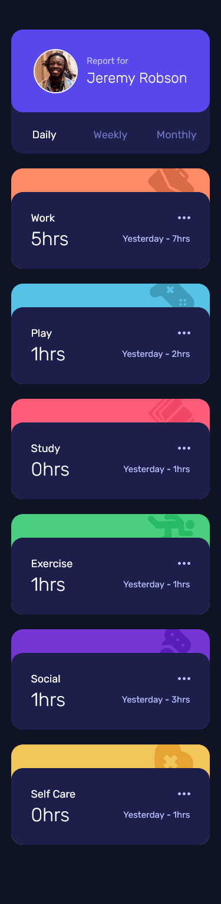
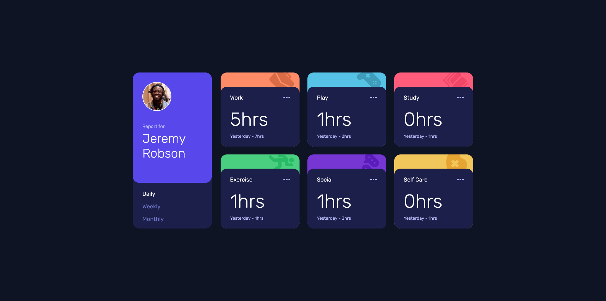

# Frontend Mentor - Time tracking dashboard solution

This is a solution to the [Time tracking dashboard challenge on Frontend Mentor](https://www.frontendmentor.io/challenges/time-tracking-dashboard-UIQ7167Jw). Frontend Mentor challenges help you improve your coding skills by building realistic projects. 

## Table of contents

- [Overview](#overview)
  - [The challenge](#the-challenge)
  - [Screenshot](#screenshot)
  - [Links](#links)
- [My process](#my-process)
  - [Built with](#built-with)
  - [Useful resources](#useful-resources)
- [Author](#author)

## Overview

### The challenge

Users should be able to:

- View the optimal layout for the site depending on their device's screen size
- See hover states for all interactive elements on the page
- Switch between viewing Daily, Weekly, and Monthly stats

### Screenshot

### Links

- Solution URL: [https://github.com/Marpace/time-tracking-dashboard/tree/main/time-tracking-dashboard-main]
- Live Site URL: [ https://marpace.github.io/time-tracking-dashboard/]

### My process

### Built with

- Semantic HTML5 markup
- Sass
- Flexbox
- Mobile-first workflow

### Useful resources

- [Complete guide to Flexbox](https://css-tricks.com/snippets/css/a-guide-to-flexbox/) - This helps me when I don't remember something about flexbox. 

## Author

- Frontend Mentor - [@Marpace](https://www.frontendmentor.io/profile/Marpace)*
